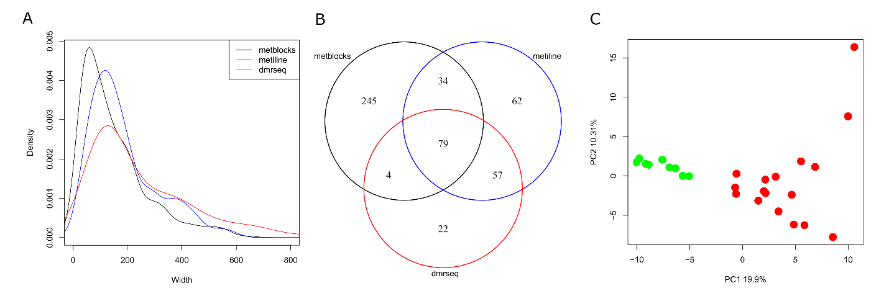
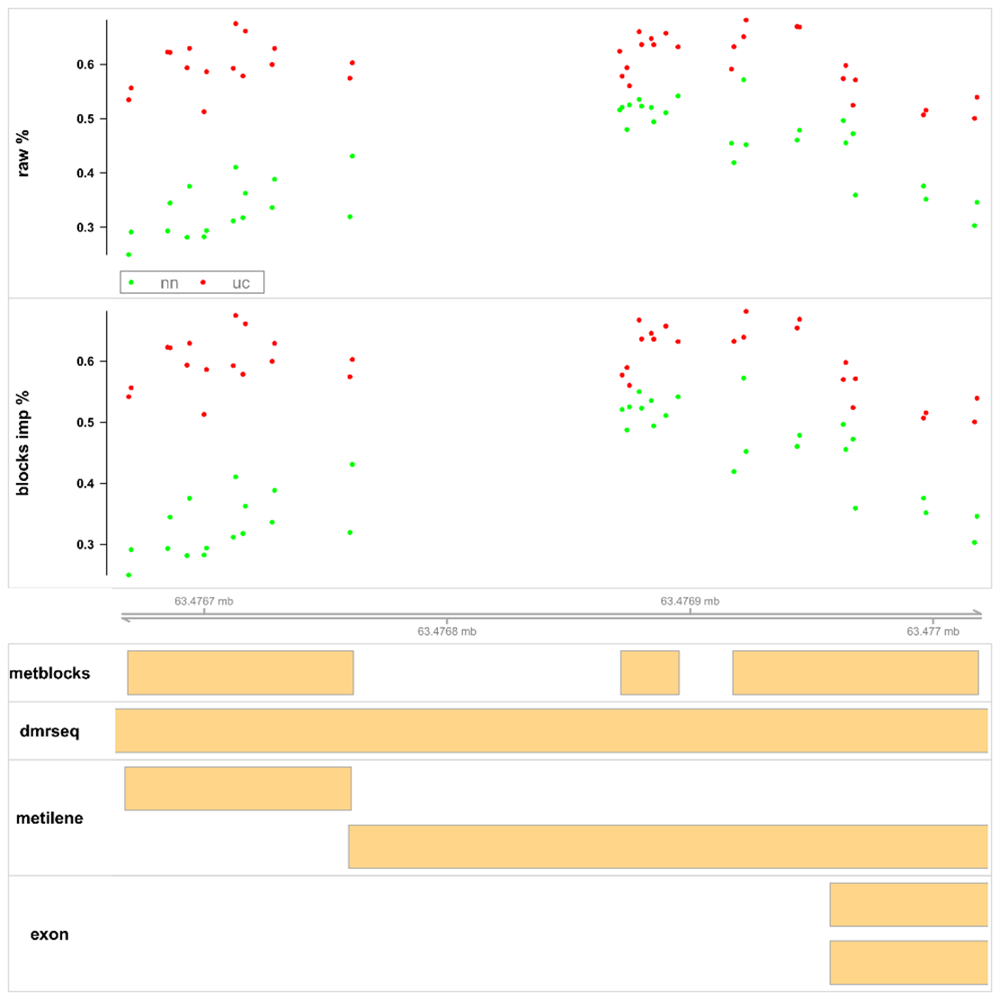

**Metblocks: An unsupervised method for the analysis of methylation data**

Christopher Graham Fenton1,2 and Ruth H. Paulssen1,2

1Clinical Bioinformatics Research Group, Department of Clinical Medicine, UiT-The Arctic University of Norway, Tromsø, Norway.

2Genomic Support Centre Tromsø (GSCT), Department of Clinical Medicine, UiT-The Arctic University of Norway, Tromsø, Norway.

**Summary**

Most methylation analysis methods contrast two or more sample groups. Metblocks is a R package that isolates variable methylated regions from methylation count data without sample group information. An unsupervised approach can be useful in identifying subgroups that can be overlooked in group contrasts providing complementary information important for precision medicine. Furthermore, in some cases obtaining samples from control or other groups is not feasible.

**Statement of need**

DNA methylation is the addition of methyl groups to DNA, and occurs mostly at CpG sites, within CpG islands(@Bernstein2007). CpG islands are often found in the promoter regions of genes in mammalian genomes(@Antequera1999). Methylation can have cis effects as methylation in promoter regions can lead to a decrease in transcript expression, or trans effects dependent on 3D chromosomal architecture(@Qin2016). Methylation status is dynamic and can vary significantly dependent on cell type composition, age, medication, and disease state among other factors(@Hls2019). Methylation methods such as whole genome bisulfite sequencing (WGBS) analysis involves the comparison of millions of CpG sites. Treating all methylation sites as statistically independent may lead to overly harsh multiple-testing penalties. To reduce the number of observations, most algorithms aggregate signal from closely packed methylation sites into regions. Regions are compared between groups of samples, and those meeting the significance criteria are labelled as differentially regulated methylation regions (DMRs). Missing values are a common problem in analyzing large scale methylation data(@Lena2020). Although different methods are used to impute the value of missing values the methods rely on a priori group information. The goal of this approach was to address the above challenges of isolating variable methylation regions without group information.

**State of field**

There are several software packages for the identification, visualization, and annotation of differentially methylated regions using sample group data. These include among others: msPipe(@Kim2022), BAT(@Hoffmann2017), bicycle(@Graa2018), GemBS(@Merkel2019),Msuite(@Sun2020),methylseq(@nfcore2024), PiGx(@Pigx2024), snake-Pipes(@Bhardwaj2019), wg-blimp(@Wste2020), RnBeads2(@Muller2019), Bismark(@Krueger2011) and coMET(@Martin2015). Many of these software implementations share algorithms for imputing missing values and finding DMRs. Common algorithms for imputing missing values and region discovery include BSmooth(@Hansen2012), metilene(@Jhling2016), dmrseq(@Korthauer2019), or DSS algorithms(@Park2016). Metblocks hopes to provide complementary information to these well-established algorithms.

**Test data**

A WGBS dataset of 9 control and 17 treatment naïve ulcerative colitis (UC) mucosal colonic biopsies was used as a test dataset. UC is a complex heterogeneous disease with considerable variation between patients. Methylation data for chromosome 18 was produced using the Bismark software package. The metblocks results were compared to two widely used DMR finding software packages, metilene and dmrseq using the same dataset. Both dmrseq and metilene isolate DMRs by comparing control and UC groups.

**Methodology**

Sites with greater than 30% missing values were removed. Each chromosome was then split into segments dependent on the distance between consecutive CpG sites. A new segment was created if the distance between consecutive CpG sites was greater than 3000 bp. Relative methylation values for the segments were then calculated by dividing the number of methylated sites by total coverage. Any missing values in segment relative methylation were imputed using the R impute package impute (version 1.76.0) impute.knn function as nearest neighbor works well with less than 30% missing values(@Jadhav2019). The imputed segment relative methylation values were used in metblocks region detection. Blocks were detected in metblocks from each segment using clustering based on Pearson correlation penalized by the genomic distance between CpG sites. An initial distance matrix was computed based on the correlation distance. Correlations were penalized by chromosomal distance using a gaussian decaying function with a bandwidth parameter. Distance decay is an important consideration in region selection as methylation levels of proximal sites are often more related than distal sites(@Affinito2020). The distance penalized correlations were clustered using single linkage hierarchical clustering (hclust) to isolate blocks. Initial analysis of metblocks results revealed that only one site or sample was often responsible for most of the variation in methylation levels. To exclude these regions an IQR (interquartile range) filter was applied. Metblocks excluded blocks where the methylation level range (maximum-minimum) divided by the interquartile (Q3-Q1) range was greater than or equal to 10. User parameters include the minimum number of CpG sites required to keep segment, bandwidth for distance decay function, minimum number of CpG sites required to keep block, the hclust threshold, iqr filtering cutoff, number of neighbors for KNN comparison, and number of cores. For example, lowering the hclust threshold gives fewer and smaller blocks or increasing the distance decay parameter penalizes CpG sites that are farther apart.

**Results**

The average size of the 585 segments meeting the criteria was 2690 bp with an average of 81 CpG sites. Metblocks found more blocks (404) as shown in Table 1 retaining a total of 0.6% of total methylation sites roughly three times more than metilene and dmrseq DMRs. Metblocks results were both smaller and contained more densely packed with CpG sites than DMRs found by the dmrseq and metilene supervised methods.

| Table 1 Comparison of regions | &nbsp; | &nbsp; | &nbsp; |
| --- | --- | --- | --- |
| &nbsp; | **metblocks** | **dmrseq** | **metilene** |
| **number of regions** | 404 | 162 | 245 |
pct of total sites** | 0.6 | 0.23 | 0.26 |
| **mean width of region** | 154.42 | 293.13 | 186.05 |
| **mean number of CpGs per region** | 18.95 | 18.41 | 13.38 |

The density distribution of regions found by all three methods is shown in Figure 1A. There is considerable genomic positional overlap between the results of all three methods as shown in Figure 1B. Metblocks isolated 245 regions that did not overlap with either of the supervised methods. These are regions that were not significantly (q.value < 0.1) differentially methylated between UC and control samples. Figure 1C shows a principal component analysis done on a matrix of relative methylation levels of all CpG sites located within metblock results. Figure1C shows that the metblocks results clearly separate between control (green) and UC (red) samples in the first principal component (PC1), suggesting that UC is the main source of variation. Metilene and dmrseq are specifically designed to find differences and produce a similar PCA result. However, metblocks provide additional methylated regions that may help differentiate between UC samples. Differences that may correlate with treatment response.

**Figure 1**: The density of the width in base pairs isolated by all three methods is shown in (**A**). The genomic overlap of all regions found in all three methods is depicted in **(B)**. A principal component analysis (PCA) of methylation levels for all sites found within metblocks results is shown in **(C)**.

Metblocks results are smaller and more densely packed with CpG sites (Figure 2). This will reduce the number of genomic features such as transcription factor binding sites that overlap and could help accelerate analysis.

**Figure 2**: Shows a visualization of methylation events from a region on chromosome 18. The top panel shows the raw relative methylation data for all samples. The second panel shows the imputed methylation level for each CpG site for each metblocks result for all samples. In these panels red is ulcerative colitis (uc) and green is control (nn). The yellow boxes show the identified regions for all three methods along with exon location at the bottom.

**Conclusion**

The metblocks approach was designed with flexible parameters to help reduce methylation data to variable methylated regions. Usage includes exploration analyses in datasets with single or unclear grouping information. The methodology is complementary to traditional supervised approaches. The identification of sub-groups or additional regions may aid in the discovery of methylated regions that are biologically significant at a group or individual level.

**Data availability**

Metblocks is provided as an R package at <https://github.com/christopher047/metblocks>. All the information needed to reproduce these results can be found on the website in <https://github.com/christopher047/metblocks/tree/main/misc>.

